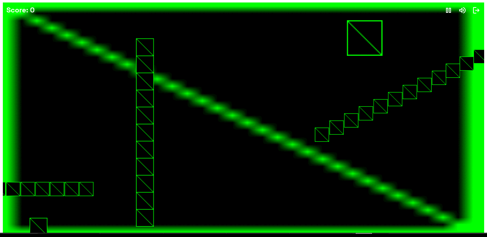

## Phaser + React + Vite: A Hackathon Game Dev Post-Mortem

>**Intended Audience**: “This write-up is for developers (especially JS devs)
curious about browser-based game development using familiar
tools like React and Vite.”

>*"A technical deep dive into the stack, tradeoffs, and painful lessons
from a $100K Web3 hackathon"*


_Figure 1: The dev progress from first draft to finished product_

### TL;DR

- **Stack**: Phaser (game logic) + React (UI) + Vite (tooling).
- **Tradeoffs**: Phaser saves time but has sparse docs; React/Phaser
separation is clean but deep integration gets messy.

## Why This Stack?

As hackathon constraints forced ruthless technical tradeoffs, we prioritized:

- Speed over familiarity: Vite’s Hot Module Replacement beat Webpack’s
complex configurations.
- Separation of concerns: React for UI, Phaser for simulation.
- Web-native delivery: No installs, no Unity bloat—just a URL.

Here’s how each piece fit.

## Tech Stack Breakdown

### Why Phaser?

#### The *"I Played Games Built With This"* Factor

Beyond the obvious perks—built-in physics, plugin ecosystem, and lightweight
2D focus—I chose Phaser for a deeply personal reason: I’d played actual games
made with it (looking at you, Mario-esque platformers). That credibility sold
me.

But let’s be real: the docs are sparse. The official documentation felt like a
treasure hunt, and I spent more time on GitHub threads, obscure blogs, and
yes—AI chatbots—to piece together how things worked.<br>
>_Tip: Ask AI to “explain Phaser’s [X] like I’m a React dev.”_

#### JavaScript

I’ll admit it: I’m a JavaScript dev at heart. The thought of learning both
game dev and a new language (looking at you, `C#`/`GDScript`) sounded like
hackathon suicide. So I evaluated JS-based options:

| Library | Verdict |
|---------|---------|
| `Three.js` | Overkill for 2D (it’s a 3D powerhouse). |
| `PixiJS` |  Great for rendering, but I’d need to wire physics/state myself. |
| `Phaser` |  Winner. It abstracts the boring stuff (like gravity) with APIs (view examples below)|

_Table 1: Comparison between frameworks_

##### Examples

###### Set Gravity

```javascript
player.body.setGravityY(1000);
```
_Listing 1: Setting gravity with `Phaser`_

```javascript
// Gravity Logic
function applyGravity() {
  if (player.isGrounded) return; // Already on ground

  // Apply gravity (with terminal velocity cap)
  player.velocityY = Math.min(player.velocityY + GRAVITY, TERMINAL_VELOCITY);
  player.y += player.velocityY;

  // Ground collision
  if (player.y + player.height >= GROUND_Y) {
    player.y = GROUND_Y - player.height;
    player.isGrounded = true;
    player.velocityY = 0;
  }
}

// Game Loop
function gameLoop() {
  applyGravity();
  // ... (render player, handle input, etc.)
  requestAnimationFrame(gameLoop);
}
gameLoop();
```
_Listing 2: Manual gravity simulation in vanilla `JavaScript`_

>“Phaser isn’t just a library—it’s a hackathon time machine. You trade some
control for all your sanity.”

#### Batteries Included

Phaser **defaults to canvas** and handles the game loop, asset loading, and
collision detection out of the box. For a hackathon, this was clutch—I could
focus on game design instead of reinventing wheels.

##### Example

###### Asset Loading

```js
// Phaser
class PreloadScene extends Phaser.Scene {
  constructor () {
    super('PreloadScene');
  }

  preload() {  
  this.load.image('player', 'assets/player.png');  
  this.load.spritesheet('enemy', 'assets/enemy.png', { frameWidth: 32, frameHeight: 32 });  
  this.load.audio('theme', 'assets/music.mp3');  
} 
```
_Listing 3: `Phaser`'s built-in asset loader_

```js
async function loadAssets() {  
  try {  
    // Load images  
    const playerImg = new Image();  
    playerImg.src = 'assets/player.png';  
    await new Promise((resolve, reject) => {  
      playerImg.onload = resolve;  
      playerImg.onerror = () => reject(new Error('Failed to load player.png'));  
    });  

    // Load audio  
    const themeAudio = new Audio('assets/music.mp3');  
    themeAudio.preload = 'auto';  
    await new Promise((resolve) => { themeAudio.oncanplaythrough = resolve; });  

    console.log('All assets loaded!');  
    return { playerImg, themeAudio };  
  } catch (error) {  
    console.error('Asset loading failed:', error);  
  }  
}  

// Usage  
loadAssets().then((assets) => {  
  document.body.appendChild(assets.playerImg); // Example DOM insertion  
});
```
_Listing 4: Manual asset loading in vanilla `JavaScript`_

##### Differences

###### Phaser

- Automatic path resolution, sprite sheet parsing, and caching.
- No need to handle DOM or manual error tracking.

###### Vanilla JS

- Requires explicit `Promise` chaining and error handling.
- Audio/images must be manually appended to the DOM.
- No built-in sprite sheet splitting or asset management.

###### Why This Matters for Hackathons:

- Phaser lets you focus on gameplay logic.
- Vanilla JS demands boilerplate for basic features (time better spent
elsewhere).

##### Takeaways

1. **Phaser’s trade-off**: Less control, more speed. Perfect for hackathons;
   less ideal for hyper-customized engines.
2. **Docs are rough**, but the community (and AI) fills the gaps.
3. **Staying in JavaScript** kept me sane. No regrets.

With Phaser chosen as our game engine, the next hurdle was making it coexist peacefully with React.

### UI vs Game Loop: Harmonious Engineering

#### The DOM Split

To avoid React’s virtual DOM diffing and Phaser’s canvas fighting for control,
we leveraged the humble `<div>`:

- `#root`: React’s mount point (for onboarding, rules, and post-game stats).
- `#game-container`: Phaser’s canvas home.

```html
<!-- DOM Split -->
  <style>
    #game-container {
      display: none;
    }
  </style>
  <body>
    <div id="root"></div>
    <div id="game-container"></div>
  </body>

  <!-- Phaser CDN (critical for setup)  -->
  <script
    src="https://cdn.jsdelivr.net/npm/phaser@3.60.0/dist/phaser.min.js">
  </script>
```
_Listing 5: The DOM Split_

#### The Toggle Trick

```javascript
// Toggle visibility on game start (React code)
const gameContainer = document.getElementById('game-container');
    gameContainer.style.display = 'block';

    // Load the Phaser game
    const { default: initGame } = await import('../../phaser/main.js');
    initGame();

    const reactRoot = document.getElementById('root');
    if (reactRoot) {
      reactRoot.style.display = 'none';
    }

  // Toggle visibility on game end (Phaser Code)
  function quitGame () {
  const game = document.getElementById('game-container');
  const root = document.getElementById('root');

  game.style.display = 'none';
  root.style.display = 'block';
}
```
_Listing 6: `React` - `Phaser` toggle functions_

>**_Note_**:_`d` = CSS `display` property_
```
Before Game Starts:

  ┌────────────────────┐       ┌──────────────────────┐
  │  React UI (#root)  │─────▶│  Visible  (d: block) │
  └────────────────────┘       └──────────────────────┘

  ┌────────────────────────┐   ┌──────────────────────┐
  │ Phaser Canvas (#game)  │─▶│ Hidden     (d: none) │
  └────────────────────────┘   └──────────────────────┘


During Gameplay:

  ┌────────────────────┐       ┌──────────────────────┐
  │  React UI (#root)  │─────▶│ Hidden     (d: none) │
  └────────────────────┘       └──────────────────────┘

  ┌────────────────────────┐   ┌──────────────────────┐
  │ Phaser Canvas (#game)  │─▶│  Visible  (d: block) │
  └────────────────────────┘   └──────────────────────┘
```
*Figure 2: DOM visibility toggle between `React` and `Phaser` containers during
gameplay flow.*

#### Why this works

- **Performance**: Phaser owns the canvas 100% during gameplay—no React state updates or re-renders.<br>
- **Simplicity**: No need to bridge frameworks mid-game (though we’ll explore exceptions below).<br>
- **Phaser’s Built-in UI**: Good Enough
Since our game’s UI was lightweight (score counters, timers), we used Phaser’s native text and image APIs:

```javascript
// Example: In-game UI with Phaser  
this.scoreText = this.add.text(10, 10, "Score: 0", { font: "16px Arial" });
```
_Listing 7: `Phaser` text implementation function_

##### Pros

- No unnecessary React ↔ Phaser communication overhead.
- Pixel-perfect positioning within the canvas.

##### When React Did Shine

- **Pre-game**: Rules, inspiration, and settings (complex UI easier in JSX).
- **Post-game**: Sharing scores/analytics (React’s state management).

>*"For character skin, we’re experimenting with controlling Phaser from React—like passing a selected skin via localStorage or even real-time updates through a shared state manager (Redux/Zustand)."*

### Vite and Build Tooling

Vite’s zero-config magic worked perfectly for React—but combining it with
Phaser required some creative engineering. Unlike Webpack (where we’d drown
in loader configurations), Vite’s simplicity let us focus on the game, not
tooling. Here’s how we tamed the beast:

>**"Unlike Webpack, Vite was born ready."**<br>
>_- Professor of Front-end Wizardry, Dr. K. (Master of Speed)_

#### The Config That Made It Possible

```javascript
import { defineConfig } from 'vite';
import react from '@vitejs/plugin-react';
import path from 'path';

export default defineConfig({
  plugins: [react()],
  optimizeDeps: {
    include: ['react', 'react-dom'] // Pre-bundle React for speed
  },
  build: {
    emptyOutDir: true, // Avoid stale files during rebuilds
    rollupOptions: {
      // Multi-page setup: React for UI, Phaser for game core
      input: {
        main: path.resolve(__dirname, './index.html'), // React entry
        game: path.resolve(__dirname, './src/phaser/main.js') // Phaser entry
      },
      output: {
        // Keep builds separated to avoid collisions
        entryFileNames: '[name]/[name]-[hash].js',
        assetFileNames: '[name]/assets/[name]-[hash].[ext]'
      }
    },
    sourcemap: false // Faster builds (sacrificed debugging for speed)
  }
});
```
_Listing 8: We used [Vite's MPA setup](https://vite.dev/guide/build.html#multi-page-app)
to define separate entry points for the React UI (index.html) and Phaser
(main.js). This gave us full control over what loads when._

#### Key Wins

- **No Phaser Plugin? No Problem**: Vite’s Rollup underpinnings(as shown in
the config) let us manually configure multi-entry builds.
- **Instant Feedback**: HMR kept our React UI updates snappy, while Phaser’s
  canvas reloaded cleanly.
- **No Webpack Nightmares**: Compared to past projects, we spent minutes on
  config—not hours.

### Lessons Learned

#### What Worked

1. **Separation of Concerns**: Keeping game/logic decoupled from UI prevented spaghetti code.
2. **Vite's Speed**: Hot module reloading let us tweak mechanics and see changes instantly. _(Not new I guess)_
  >"Vite’s ‘batteries-included’ approach shines—until you need to weld on new
batteries. A few tweaks unlocked the best of both worlds."
3. **Git Branching (Belatedly)**: We ignored branches until a failed React auth integration tangled our codebase. Mid-project crisis made us realize the importance
  >**_Lesson_**: Branch first or cry later. 
4. **Frequent Commits**: When our physics engine broke post-refactor, `git bisect` pinpointed the bad commit in minutes. 
  >**_New rule_**: Commit every small, working change.

##### Pausing the Game Was Surprisingly Complex
At first, I assumed pausing would be as simple as calling this.scene.pause(). But that doesn’t cut it when you're managing moving obstacles, tokens, powerups, and background tiles — all updated manually or via physics.

I ended up building this custom pause/resume system:

```js
togglePause () {
  this.isPaused = !this.isPaused;

  if (this.isPaused) {
    this.physics.world.isPaused = true;
    this.time.paused = true;
    this.bgMusic.pause();
    this.pauseGame();

    this.scene.pause('GameScene');
  } else {
    this.physics.world.isPaused = false;
    this.time.paused = false;
    this.bgMusic.resume();
    this.resumeGame();

    this.scene.resume('GameScene');
  }
}
```
_Listing 9: Toggle Pause/Play function_

```js
pauseGame () {
  this.isPaused = true;
  this.physics.world.isPaused = true;
  this.time.paused = true;

  pauseVelocity([
    ...this.obstacles.getChildren(),
    ...this.tokens.getChildren(),
    ...this.powerups.getChildren()
  ]);

  this.backgrounds.forEach(bg => {
    bg.tilePositionXFreeze = true;
  });
}

resumeGame () {
  this.isPaused = false;
  this.physics.world.isPaused = false;
  this.time.paused = false;

  resumeVelocity([
    ...this.obstacles.getChildren(),
    ...this.tokens.getChildren(),
    ...this.powerups.getChildren()
  ]);

  this.backgrounds.forEach(bg => {
    bg.tilePositionXFreeze = false;
  });
}
```
_Listing 10: Pause/ Play Helper functions_

This system works by:

- Toggling physics.world.isPaused and time.paused
- Freezing/resuming tilePositionX movement of background layers
- Calling pauseVelocity() and resumeVelocity() on all dynamic objects

Even though the rest of the project felt straightforward, **this part alone burned more hours than any other feature**.

##### Git Discipline: Hard Lessons, Fast Fixes

I finally internalized the “commit often” mantra. Midway through, a change
broke something crucial—but I hadn’t committed in a while. Debugging became a
nightmare. Frequent commits aren’t just tidy—they’re checkpoints you’ll thank
yourself for later.

Branching also bit me. I added a sign-in flow directly to main, assuming it’d
be quick. It wasn’t. The feature ballooned and touched core logic. Undoing
the damage without a dedicated branch? Brutal.

###### Key takeaways:

- Commit early, commit often—it’s your personal undo button.
- Always branch for new features, no matter how “small” they seem.
- Planning matters. Git hygiene saved me, but a better structure would’ve
saved even more time.

#### What We'd Change

1. **Scope Ruthlessly**: We planned 10 features; 4 shipped. MVP-first next
time!.
2. **Team Screening**: Our “illustrator” ghosted us, forcing last-minute
asset scrambles.
  >Lesson: Vet collaborators or go solo.

### Final Thoughts

This project pushed me to bridge multiple web technologies under intense time
pressure. While not every feature made it into the final MVP, I came away
with stronger skills in architecture, tool-chain optimization, and development
workflow. Most importantly, I now understand how to document and reflect on
technical decisions with clarity—something I’ll carry into every future
project.

### Demo

**Live Demo:** [https://runner.kokeh.dev](https://runner.kokeh.dev)

### Explore the Full Source

[](https://github.com/itskokeh/citrus-runner)<br>
_Feature requests are welcome_
