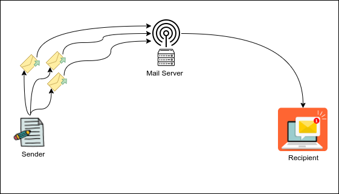
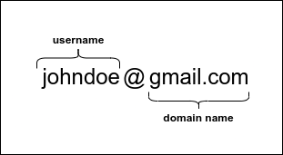
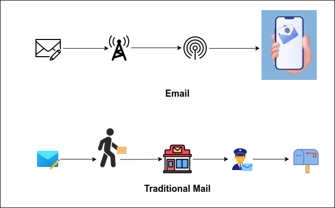

<h1>How Email Works: A Non-Technical Look Behind The Scenes</h1>

Have you ever wondered how an email travels from your computer or phone to
someone else’s inbox? It might seem like magic, but it’s actually a fascinating
process that happens in just a few seconds. Let’s break it down step by step!

## What is Email?

Email, short for "electronic mail," is a way to send messages, pictures, or
documents over the internet. It’s like sending a letter, but instead of paper
and stamps, you use a computer or smartphone.

## The Basics of Sending an Email

When you send an email, it goes through a series of steps to reach the
recipient. Here’s how it works:

1. **Composing the Email**  
   You start by writing your message in an email app like Gmail, Outlook, or
   Yahoo Mail. You add the recipient’s email address
   (like their digital mailbox) and hit "Send."

2. **Sending the Email**  
   Once you hit "Send," your email is broken into small pieces called
   **packets**. These packets travel through the internet, just like cars on a
   highway.

3. **Delivering the Email**  
   The packets arrive at a **mail server**, which acts like a digital post
   office. The server figures out where the recipient’s email address is located
   and forwards the message.

4. **Receiving the Email**  
   Finally, the email arrives at the recipient’s inbox. They can open it, read
   your message, and reply if they want!

   

## How Does the Email Know Where to Go?

Every email address has two main parts:

- The **username** (e.g., `john.doe`), which is unique to the person.
- The **domain name** (e.g., `gmail.com`), which tells the email where to go.

When you send an email, the domain name (like `gmail.com` or `yahoo.com`) helps
the mail server figure out where to deliver it. It’s like writing a zip code on
a letter to make sure it goes to the right city.

## Is Email Secure?

Yes, email is designed to be secure! Here’s how:

- **Passwords**: You need a password to access your email account, so only you
  can read your messages.
- **Encryption**: Some emails are scrambled into a secret code while they travel
  through the internet, so hackers can’t read them.

   

## Real Analogy: Email is Like Sending a Letter

Think of email like sending a traditional letter:

- **Composing**: Writing the letter.
- **Sending**: Putting it in an envelope and dropping it in a mailbox.
- **Delivering**: The post office sorts and delivers it.
- **Receiving**: The recipient opens their mailbox and reads the letter.

The only difference is that email happens almost instantly, and you don’t need
stamps!

## Why is Email Important?

Email is one of the most popular ways to communicate because:

- It’s fast and reliable.
- You can send messages to anyone, anywhere in the world.
- It’s free (as long as you have an internet connection)!

## Quick Recap

- Email is a digital way to send messages over the internet.
- It travels through servers, which act like digital post offices.
- Every email address has a username and a domain name.
- Email is secure because of passwords and encryption.

## Try It Yourself

Now that you know how email works, why not send one to a friend or family
member? Pay attention to the steps: composing, sending, and waiting for a reply.
You’ll see the magic of email in action!
